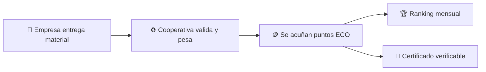

# 🌱 ECOToken

### Reciclar tiene recompensa

Proyecto Final 2026 · UTN FRVM · Ingeniería en Sistemas de Información · Equipo **ClusterPA**

---

## El problema

Las empresas que reciclan hoy no tienen forma de **demostrarlo**. No hay un registro confiable de cuánto material entregan, las cooperativas que retiran los residuos no tienen un sistema en común con ellas, y todo ese esfuerzo ambiental queda invisible: no suma reputación, no se puede mostrar a clientes o municipios, y no hay ningún incentivo real para reciclar más.

## La solución

**ECOToken** convierte el reciclaje empresarial en un dato público, verificable y a prueba de manipulación.

- Una **empresa adherida** entrega material reciclable a una **cooperativa validadora**.
- La cooperativa registra el ingreso (tipo de material, peso).
- El sistema reconoce ese esfuerzo con puntos **ECO**, un token que representa **reputación ambiental**, no dinero.
- Cada mes se arma un **ranking público** de empresas más comprometidas, y quien recicló recibe un **certificado digital verificable**.
- La **municipalidad** respalda el reconocimiento institucionalmente.



Todo el movimiento de puntos queda registrado sobre **blockchain** (Ethereum, testnet Sepolia), así nadie —ni el sistema, ni una empresa, ni la cooperativa— puede alterar el historial después de que ocurrió. Es un libro de contabilidad ambiental que nadie puede borrar.

Para que ninguna empresa o cooperativa tenga que lidiar con criptomonedas, billeteras o gas: el sistema es **custodial**. ECOToken administra esa complejidad por detrás; para el usuario, es solo una web donde entra, ve su historial y descarga su certificado.

> Documentación técnica completa: [`doc/ESTRUCTURA-PROYECTO.md`](doc/ESTRUCTURA-PROYECTO.md).

## Estado del proyecto

**Sprint 4** en curso.

## Estructura del monorepo

```
ECOToken/
├── contracts/   # Smart contracts en Solidity (Foundry + Hardhat)
├── backend/     # API NestJS + Prisma + PostgreSQL + integración on-chain
├── frontend/    # SPA React + Vite + Tailwind (paneles por actor)
├── infra/       # Docker y scripts de despliegue
├── doc/         # Documentación del proyecto
└── .github/     # Workflows de CI (GitHub Actions)
```

## Arranque rápido (desarrollo)

Requisitos previos:
- Docker Desktop + Docker Compose instalados.
- Puertos 3000, 5173 y 5432 libres en tu máquina.

```bash
# 1) Variables de entorno opcionales (solo si querés personalizar valores)
cp .env.example .env

# 2) Levantar la infraestructura completa con un solo comando
docker compose up -d
```

Esto levanta:
- PostgreSQL en `localhost:5432`
- Backend NestJS en `http://localhost:3000`
- Frontend Vite en `http://localhost:5173`

Si necesitás ver logs:

```bash
docker compose logs -f backend frontend postgres
```

Para detener todo:

```bash
docker compose down
```

> Si querés trabajar solo con la base de datos desde el host, podés seguir usando `docker compose up -d postgres`.

## Estrategia de ramas

- `main` — rama estable (solo cambios validados / aptos para entrega).
- `develop` — rama de integración.
- `feature/*` — nuevas funcionalidades.
- `fix/*` — correcciones.
- `release/*` — preparación de entregas.

Flujo: rama desde `develop` → commits descriptivos ([Conventional Commits](doc/ESTRUCTURA-PROYECTO.md)) → Pull Request a `develop` → **revisión por otro integrante** antes de integrar.

## Equipo ClusterPA

Alves Rodrigo · Martínez Mateo · Rojas Pessuto Tobías · Pineda Álvaro (director del proyecto).
