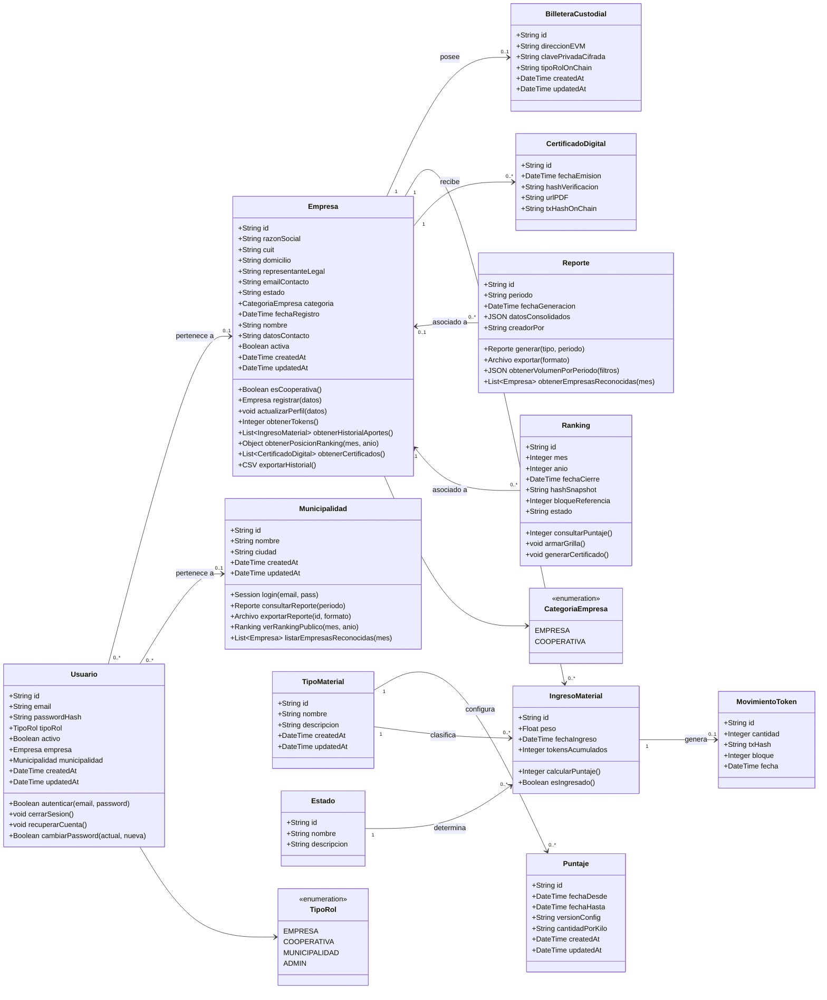

# ECOToken — Diagrama de clases

Este documento describe las clases de dominio de **ECOToken**, sus atributos,
operaciones principales y relaciones.

La estructura está alineada con el modelo Prisma incorporado en el commit
`d80d1ba1187805271e53125371ddb607b4a7b328`.

> **Nota de implementación:** las clases `*.entity.ts` representan la estructura
> de las entidades. Las operaciones de negocio se implementan principalmente en
> los servicios NestJS (`*.service.ts`).
>
> **Cooperativa:** no existe como entidad independiente. Se representa mediante
> una `Empresa` cuya `categoria` es `COOPERATIVA`.

---

## 1. Diagrama general



---

## 2. Enumeraciones

### 2.1. `TipoRol`

Representa el rol funcional del usuario dentro de la plataforma.

```text
EMPRESA
COOPERATIVA
MUNICIPALIDAD
ADMIN
```

### 2.2. `CategoriaEmpresa`

Permite distinguir una empresa convencional de una cooperativa validadora.

```text
EMPRESA
COOPERATIVA
```

---

## 3. Clases

## 3.1. `Usuario`

Representa una cuenta con acceso a la plataforma. Según su rol, puede estar
asociada con una empresa o con una municipalidad.

### Atributos

| Atributo | Tipo | Obligatorio | Descripción |
|---|---|---:|---|
| `id` | `String` | Sí | Identificador único. |
| `email` | `String` | Sí | Correo electrónico único. |
| `passwordHash` | `String` | Sí | Hash de la contraseña. |
| `tipoRol` | `TipoRol` | Sí | Rol funcional del usuario. |
| `activo` | `Boolean` | Sí | Indica si la cuenta está habilitada. |
| `empresa` | `Empresa` | No | Empresa a la que pertenece el usuario. |
| `municipalidad` | `Municipalidad` | No | Municipalidad a la que pertenece el usuario. |
| `createdAt` | `DateTime` | Sí | Fecha de creación. |
| `updatedAt` | `DateTime` | Sí | Fecha de última actualización. |

### Operaciones

| Operación | Retorno | Descripción |
|---|---|---|
| `autenticar(email, password)` | `Boolean` | Valida las credenciales del usuario. |
| `cerrarSesion()` | `void` | Finaliza o invalida la sesión activa. |
| `recuperarCuenta()` | `void` | Inicia el proceso de recuperación de cuenta. |
| `cambiarPassword(actual, nueva)` | `Boolean` | Cambia la contraseña luego de validar la actual. |

---

## 3.2. `Municipalidad`

Representa al organismo público que consulta reportes y rankings ambientales.

### Atributos

| Atributo | Tipo | Obligatorio | Descripción |
|---|---|---:|---|
| `id` | `String` | Sí | Identificador único. |
| `nombre` | `String` | Sí | Nombre de la municipalidad. |
| `ciudad` | `String` | Sí | Ciudad correspondiente. |
| `usuarios` | `List<Usuario>` | No | Usuarios vinculados con la municipalidad. |
| `createdAt` | `DateTime` | Sí | Fecha de creación. |
| `updatedAt` | `DateTime` | Sí | Fecha de última actualización. |

### Operaciones

| Operación | Retorno | Descripción |
|---|---|---|
| `login(email, pass)` | `Session` | Inicia una sesión municipal. |
| `consultarReporte(periodo)` | `Reporte` | Obtiene el reporte de un período. |
| `exportarReporte(id, formato)` | `Archivo` | Exporta un reporte. |
| `verRankingPublico(mes, anio)` | `Ranking` | Consulta el ranking público mensual. |
| `listarEmpresasReconocidas(mes)` | `List<Empresa>` | Lista las empresas reconocidas. |

---

## 3.3. `Empresa`

Representa una empresa adherida o una cooperativa validadora.

Una cooperativa se identifica mediante:

```text
categoria = COOPERATIVA
```

### Atributos

| Atributo | Tipo | Obligatorio | Descripción |
|---|---|---:|---|
| `id` | `String` | Sí | Identificador único. |
| `razonSocial` | `String` | Sí | Razón social registrada. |
| `cuit` | `String` | Sí | CUIT único. |
| `domicilio` | `String` | No | Domicilio declarado. |
| `representanteLegal` | `String` | No | Representante legal. |
| `emailContacto` | `String` | No | Correo de contacto. |
| `estado` | `String` | No | Estado general de la empresa. |
| `categoria` | `CategoriaEmpresa` | Sí | Empresa convencional o cooperativa. |
| `fechaRegistro` | `DateTime` | Sí | Fecha de registro. |
| `nombre` | `String` | No | Nombre comercial. |
| `datosContacto` | `String` | No | Información adicional de contacto. |
| `activa` | `Boolean` | Sí | Indica si la empresa está activa. |
| `usuarios` | `List<Usuario>` | No | Usuarios pertenecientes a la empresa. |
| `ingresos` | `List<IngresoMaterial>` | No | Historial de ingresos de material. |
| `billeteraCustodial` | `BilleteraCustodial` | No | Billetera custodial asociada. |
| `certificados` | `List<CertificadoDigital>` | No | Certificados emitidos. |
| `reportes` | `List<Reporte>` | No | Reportes asociados. |
| `rankings` | `List<Ranking>` | No | Registros de ranking asociados. |
| `createdAt` | `DateTime` | Sí | Fecha de creación técnica. |
| `updatedAt` | `DateTime` | Sí | Fecha de última actualización. |

### Operaciones

| Operación | Retorno | Descripción |
|---|---|---|
| `esCooperativa()` | `Boolean` | Indica si `categoria` es `COOPERATIVA`. |
| `registrar(datos)` | `Empresa` | Registra una nueva empresa. |
| `actualizarPerfil(datos)` | `void` | Actualiza los datos del perfil. |
| `obtenerTokens()` | `Integer` | Obtiene el total de tokens acumulados. |
| `obtenerHistorialAportes()` | `List<IngresoMaterial>` | Recupera el historial de aportes. |
| `obtenerPosicionRanking(mes, anio)` | `Object` | Calcula o consulta la posición en el ranking. |
| `obtenerCertificados()` | `List<CertificadoDigital>` | Obtiene los certificados emitidos. |
| `exportarHistorial()` | `CSV` | Exporta el historial de aportes. |

> `PosicionRanking` no es actualmente una entidad Prisma. La operación devuelve
> un objeto calculado por el servicio.

---

## 3.4. `BilleteraCustodial`

Representa la billetera EVM administrada por la plataforma para una empresa.

### Atributos

| Atributo | Tipo | Obligatorio | Descripción |
|---|---|---:|---|
| `id` | `String` | Sí | Identificador único. |
| `direccionEVM` | `String` | Sí | Dirección EVM única. |
| `clavePrivadaCifrada` | `String` | Sí | Clave privada almacenada de forma cifrada. |
| `tipoRolOnChain` | `String` | Sí | Rol asignado on-chain. |
| `empresa` | `Empresa` | Sí | Empresa propietaria de la billetera. |
| `createdAt` | `DateTime` | Sí | Fecha de creación. |
| `updatedAt` | `DateTime` | Sí | Fecha de última actualización. |

### Operaciones

No se definieron operaciones de dominio específicas. El módulo expone
operaciones CRUD mediante su servicio.

---

## 3.5. `Reporte`

Representa información consolidada de un período.

### Atributos

| Atributo | Tipo | Obligatorio | Descripción |
|---|---|---:|---|
| `id` | `String` | Sí | Identificador único. |
| `periodo` | `String` | Sí | Período representado. |
| `fechaGeneracion` | `DateTime` | Sí | Fecha de generación. |
| `datosConsolidados` | `JSON` | Sí | Datos agregados del reporte. |
| `creadorPor` | `String` | Sí | Identificador o referencia del creador. |
| `empresa` | `Empresa` | No | Empresa asociada, cuando corresponda. |

### Operaciones

| Operación | Retorno | Descripción |
|---|---|---|
| `generar(tipo, periodo)` | `Reporte` | Genera un reporte consolidado. |
| `exportar(formato)` | `Archivo` | Exporta el reporte. |
| `obtenerVolumenPorPeriodo(filtros)` | `JSON` | Calcula el volumen aplicando filtros. |
| `obtenerEmpresasReconocidas(mes)` | `List<Empresa>` | Obtiene las empresas reconocidas. |

---

## 3.6. `TipoMaterial`

Representa una categoría de material reciclable admitida por la plataforma.

### Atributos

| Atributo | Tipo | Obligatorio | Descripción |
|---|---|---:|---|
| `id` | `String` | Sí | Identificador único. |
| `nombre` | `String` | Sí | Nombre único del material. |
| `descripcion` | `String` | No | Descripción del material. |
| `puntajes` | `List<Puntaje>` | No | Configuraciones de conversión históricas. |
| `ingresos` | `List<IngresoMaterial>` | No | Ingresos clasificados con este material. |
| `createdAt` | `DateTime` | Sí | Fecha de creación. |
| `updatedAt` | `DateTime` | Sí | Fecha de última actualización. |

### Operaciones

No se definieron operaciones de dominio específicas.

---

## 3.7. `Estado`

Representa un estado posible del ciclo de vida de un ingreso de material.

Ejemplos cargados inicialmente:

```text
REGISTRADO
VALIDADO
ACUNADO
```

### Atributos

| Atributo | Tipo | Obligatorio | Descripción |
|---|---|---:|---|
| `id` | `String` | Sí | Identificador único. |
| `nombre` | `String` | Sí | Nombre único del estado. |
| `descripcion` | `String` | No | Descripción del estado. |
| `ingresos` | `List<IngresoMaterial>` | No | Ingresos que utilizan este estado. |

### Operaciones

No se definieron operaciones de dominio específicas.

---

## 3.8. `Puntaje`

Representa la configuración de conversión entre peso y tokens para un tipo de
material durante un período determinado.

### Atributos

| Atributo | Tipo | Obligatorio | Descripción |
|---|---|---:|---|
| `id` | `String` | Sí | Identificador único. |
| `fechaDesde` | `DateTime` | Sí | Inicio de vigencia. |
| `fechaHasta` | `DateTime` | No | Fin de vigencia. |
| `versionConfig` | `String` | Sí | Versión de la configuración. |
| `cantidadPorKilo` | `String` | Sí | Cantidad de tokens asignada por kilo. |
| `tipoMaterial` | `TipoMaterial` | Sí | Material al que corresponde. |
| `createdAt` | `DateTime` | Sí | Fecha de creación. |
| `updatedAt` | `DateTime` | Sí | Fecha de última actualización. |

### Operaciones

No se definieron operaciones de dominio específicas.

---

## 3.9. `IngresoMaterial`

Representa el registro de un aporte de material reciclable.

### Atributos

| Atributo | Tipo | Obligatorio | Descripción |
|---|---|---:|---|
| `id` | `String` | Sí | Identificador único. |
| `peso` | `Float` | Sí | Peso ingresado. |
| `fechaIngreso` | `DateTime` | Sí | Fecha del ingreso. |
| `tokensAcumulados` | `Integer` | Sí | Tokens calculados o acumulados. |
| `empresa` | `Empresa` | Sí | Empresa responsable del aporte. |
| `tipoMaterial` | `TipoMaterial` | Sí | Tipo de material registrado. |
| `estado` | `Estado` | Sí | Estado actual del ingreso. |
| `movimientoToken` | `MovimientoToken` | No | Movimiento on-chain generado. |

### Operaciones

| Operación | Retorno | Descripción |
|---|---|---|
| `calcularPuntaje()` | `Integer` | Calcula `peso × cantidadPorKilo`. |
| `esIngresado()` | `Boolean` | Verifica si el ingreso está registrado. |

---

## 3.10. `MovimientoToken`

Representa un movimiento on-chain generado a partir de un ingreso validado.

### Atributos

| Atributo | Tipo | Obligatorio | Descripción |
|---|---|---:|---|
| `id` | `String` | Sí | Identificador único. |
| `cantidad` | `Integer` | Sí | Cantidad de tokens involucrados. |
| `txHash` | `String` | No | Hash de la transacción. |
| `bloque` | `Integer` | No | Bloque de confirmación. |
| `fecha` | `DateTime` | Sí | Fecha del movimiento. |
| `ingresoMaterial` | `IngresoMaterial` | Sí | Ingreso que originó el movimiento. |

### Operaciones

No se definieron operaciones de dominio específicas.

---

## 3.11. `CertificadoDigital`

Representa un certificado verificable emitido a una empresa.

### Atributos

| Atributo | Tipo | Obligatorio | Descripción |
|---|---|---:|---|
| `id` | `String` | Sí | Identificador único. |
| `fechaEmision` | `DateTime` | Sí | Fecha de emisión. |
| `hashVerificacion` | `String` | Sí | Hash utilizado para verificar integridad. |
| `urlPDF` | `String` | No | URL del certificado generado. |
| `txHashOnChain` | `String` | No | Transacción de anclaje on-chain. |
| `empresa` | `Empresa` | Sí | Empresa receptora. |

### Operaciones

No se definieron operaciones de dominio específicas.

---

## 3.12. `Ranking`

Representa el registro mensual del reconocimiento ambiental de una empresa.

### Atributos

| Atributo | Tipo | Obligatorio | Descripción |
|---|---|---:|---|
| `id` | `String` | Sí | Identificador único. |
| `mes` | `Integer` | Sí | Mes del ranking. |
| `anio` | `Integer` | Sí | Año del ranking. |
| `fechaCierre` | `DateTime` | No | Fecha de cierre del período. |
| `hashSnapshot` | `String` | No | Hash del snapshot auditable. |
| `bloqueReferencia` | `Integer` | No | Bloque utilizado como referencia. |
| `estado` | `String` | No | Estado del ranking. |
| `empresa` | `Empresa` | No | Empresa asociada al registro. |

### Operaciones

| Operación | Retorno | Descripción |
|---|---|---|
| `consultarPuntaje()` | `Integer` | Consulta el puntaje acumulado. |
| `armarGrilla()` | `void` | Construye la grilla de un período. |
| `generarCertificado()` | `void` | Genera un certificado para la empresa. |

---

## 4. Relaciones y multiplicidades

| Relación | Multiplicidad | Descripción |
|---|---|---|
| `Usuario` — `Empresa` | `0..*` a `0..1` | Una empresa puede tener muchos usuarios; un usuario puede pertenecer a una empresa. |
| `Usuario` — `Municipalidad` | `0..*` a `0..1` | Una municipalidad puede tener muchos usuarios; un usuario puede pertenecer a una municipalidad. |
| `Empresa` — `BilleteraCustodial` | `1` a `0..1` | Una empresa puede tener como máximo una billetera. |
| `Empresa` — `IngresoMaterial` | `1` a `0..*` | Una empresa registra múltiples ingresos. |
| `Empresa` — `CertificadoDigital` | `1` a `0..*` | Una empresa puede recibir múltiples certificados. |
| `Empresa` — `Reporte` | `0..1` a `0..*` | Un reporte puede estar asociado opcionalmente con una empresa. |
| `Empresa` — `Ranking` | `0..1` a `0..*` | Un registro de ranking puede estar asociado opcionalmente con una empresa. |
| `TipoMaterial` — `Puntaje` | `1` a `0..*` | Un material puede tener configuraciones históricas de puntaje. |
| `TipoMaterial` — `IngresoMaterial` | `1` a `0..*` | Un tipo de material clasifica múltiples ingresos. |
| `Estado` — `IngresoMaterial` | `1` a `0..*` | Un estado puede ser utilizado por múltiples ingresos. |
| `IngresoMaterial` — `MovimientoToken` | `1` a `0..1` | Un ingreso puede generar como máximo un movimiento on-chain. |

---

## 5. Consideraciones del modelo actual

1. La asociación de `Usuario` con `Empresa` y `Municipalidad` es opcional en la
   base de datos. La coherencia entre estas asociaciones y `tipoRol` debe
   validarse en la lógica de negocio.

2. `Ranking` está modelado actualmente como un registro opcionalmente asociado
   con una empresa. No existe todavía una entidad persistida
   `PosicionRanking`.

3. `Reporte.creadorPor` es actualmente un `String`; no existe una relación
   persistida con `Usuario` o `Municipalidad`.

4. `cantidadPorKilo` se almacena actualmente como `String` para conservar la
   estructura del commit. Una futura revisión podría utilizar `Decimal`.

5. Los campos `estado` de `Empresa` y `Ranking` son texto libre. La entidad
   `Estado` se utiliza únicamente para `IngresoMaterial`.

6. La clave privada de `BilleteraCustodial` no debe exponerse en respuestas,
   logs ni mensajes de error. Debe permanecer cifrada durante su
   almacenamiento.
