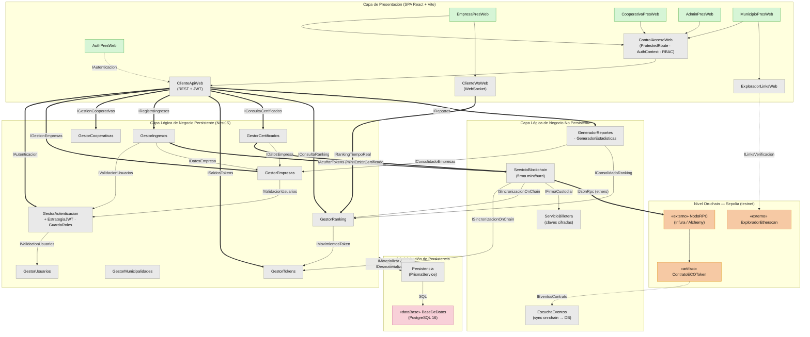

# ECOToken — Diagrama de Componentes

Vista de componentes por capas (presentación, lógica de negocio persistente y no
persistente, persistencia) y su integración on-chain en Sepolia. Modelo custodial:
el frontend nunca gestiona claves.

> Las **entidades** (Empresa, Usuario, IngresoMaterial, etc.) no se incluyen acá:
> son datos y están en el **diagrama de clases**. Este diagrama muestra solo
> componentes (gestores y servicios).

