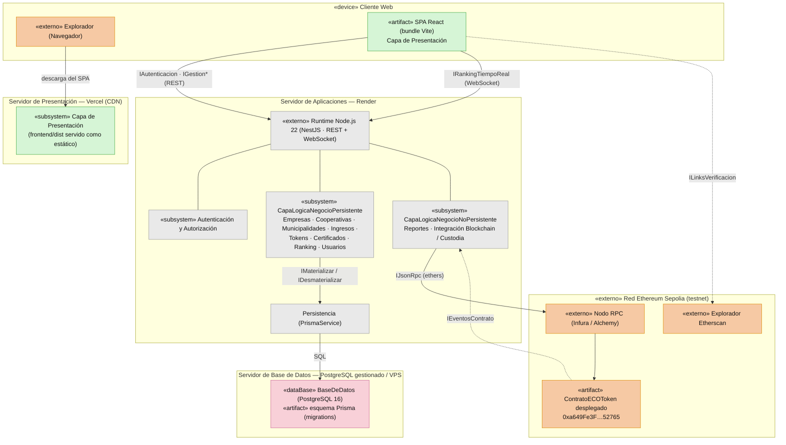

# ECOToken — Diagrama de Despliegue

Distribución física del sistema: cliente web, hosting estático del frontend
(Vercel/CDN), servidor de aplicaciones (Render, NestJS), base de datos gestionada
(PostgreSQL) y la capa on-chain en la red Ethereum Sepolia (testnet).

